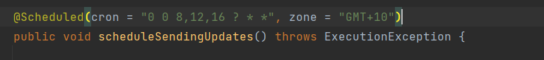
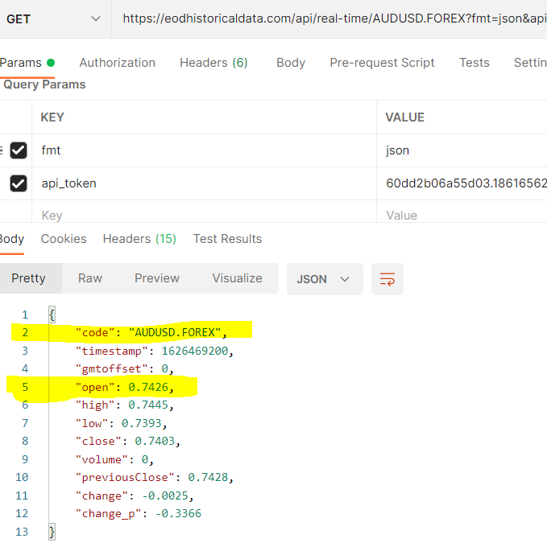

# **FOREX-DATA**
*****

This project helps to subscribe forex conversion rate of given currency pair. Conversion APIs are provided by the site https://eodhistoricaldata.com which provides financial Data APIs.

User can subscribe with their email, and they will receive an email with attached CSV file which contains FOREX code and FOREX value for given pair. This system will automatically send email every day at 8 AM, 12 Noon and 4 PM.

## Requirements

For building and running the application you need:

- [JDK 1.8](http://www.oracle.com/technetwork/java/javase/downloads/jdk8-downloads-2133151.html)
- [Maven 3](https://maven.apache.org)

## Running Forex-Data locally
```
	git clone https://github.com/sulabhbartaula/forex-data.git
	cd forex-data
	git checkout springboot
	./mvnw spring-boot:run
```
Since the project was developed using IntelliJ IDE, you can clone the project >> File >> New Project from Version Control


Run the application.

You can then subscribe to forex-data here: http://localhost:8080/

Enter your email to subscribe.

## Getting Started

1. Select currency pair of your choice in CurrencyPair.Java file under Model package.

   
2. Setup file storage path in your local machine. This determines the folder where your file will be stored. 
   Goto CreateFileService.Java and change value of String path = 
   
   
3. Inside the email service change the value of sender's email and password.


4. Subscribe to https://eodhistoricaldata.com for your personal API token. 
   Free service has per day limit of 20. 
   Change the value of token inside SubscribeService.Java inside service package.
   
   
After all these personal modifications, you should be ready to run the program.

User Interface is kept simple at this stage to minimize complexity and focus more on backend.

## Functionality

1. After we run the application at localhost:8080/, it will ask user for the email to subscribe.


2. After user enters email and hits subscribe, startSubscription() method inside HomeController will be called.

3. This will now call the method inside SubscribeService which contains business logic which is scheduled to run at 8 am, 12 noon and 4 pm every day.

   
4. Inside this method, API call will be made for each of the value in CurrencyPair listed.
Each pair's currency code and opening value is taken into consideration for this project. All the values of different currency pair is now saved inside the csv file and sent to input email.
   
   There are several values, but we are taking only one value of open for this project.